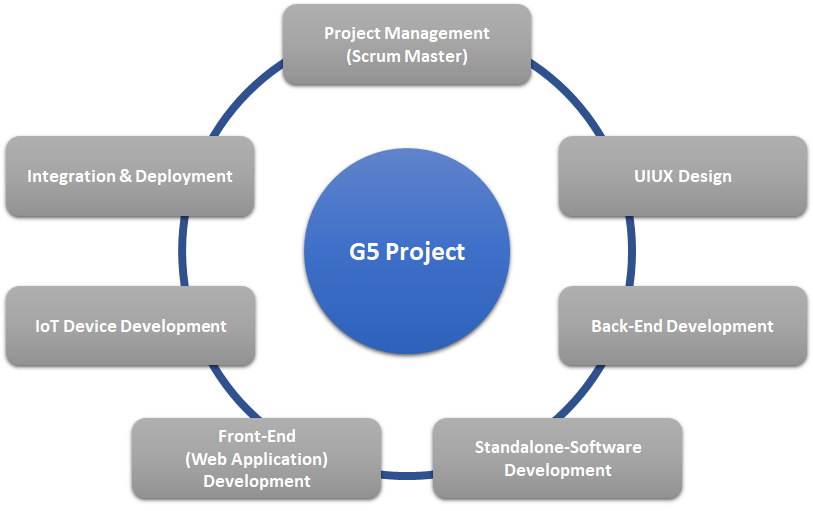
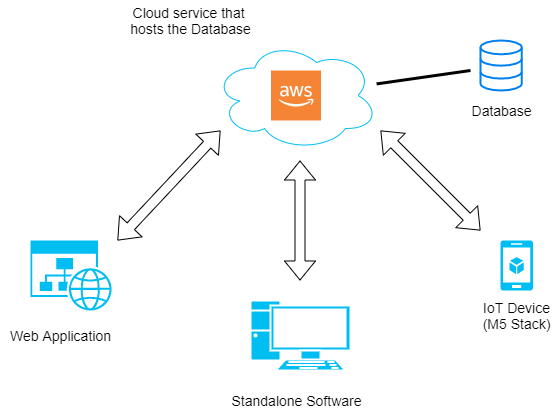
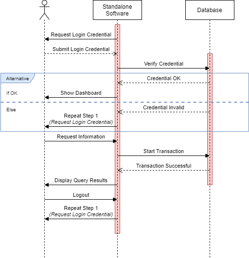
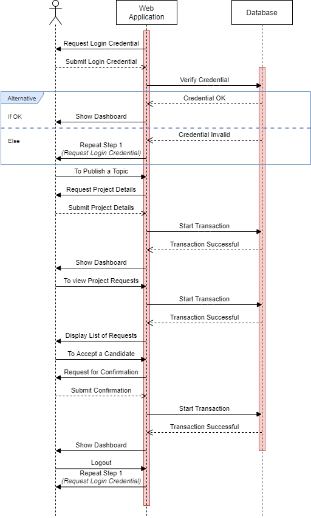
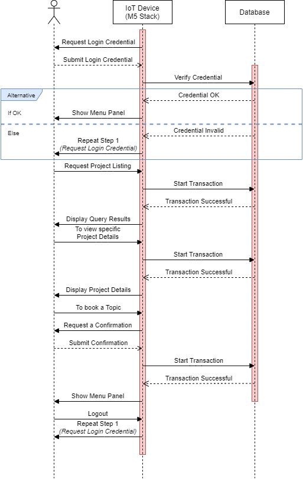
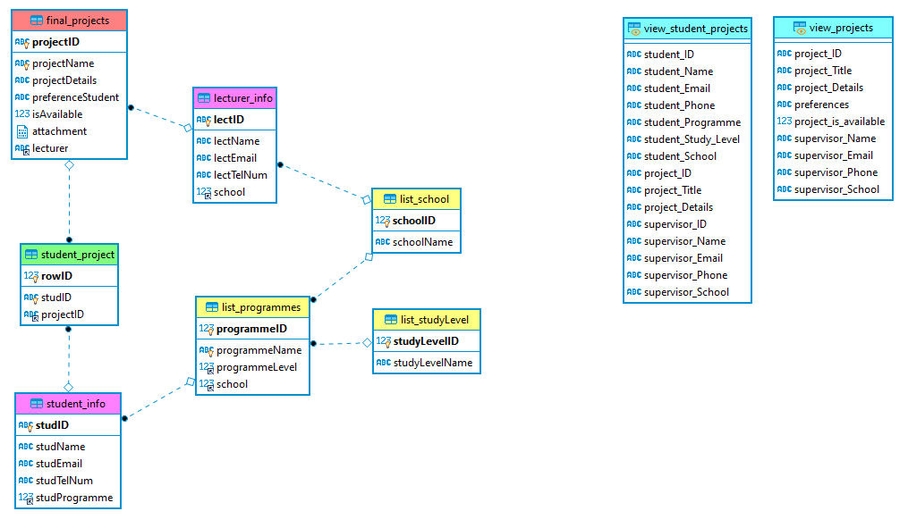
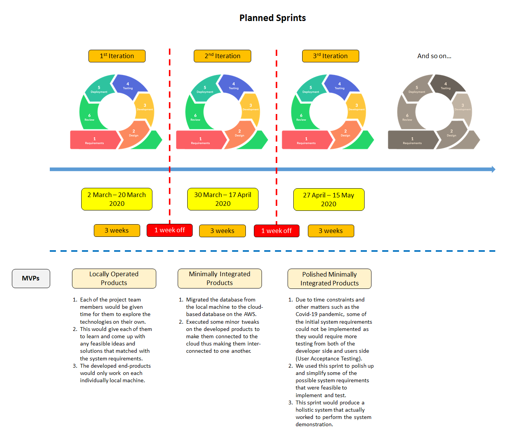

# COMSM1401 - Software Engineering & Group Project

The aims of this unit are to introduce students to the basic principles of software engineering, reinforce their software development skills, and to apply these skills as part of a team. This unit teaches the use of well-established software engineering techniques, and involves you working in groups to design, specify and implement some software system.

> **Software Engineering** : structured programming; modularisation; object-oriented techniques; specification; verification; validation; testing; debugging; the software engineering life-cycle; extreme programming.

> **Project Management** : introduction to project management - how to manage teams; PM and team roles; requirement specification; task allocation; scheduling and planning.

---

## Table of Contents

- [About Our Group](#About-Our-Group)
  - [Group Members](#Group-Members)
  - [How We Operate](#How-We-Operate)
- [About Our Project](#About-Our-Project)
  - [System Overview](#System-Overview)
  - [System Design](#System-Design)
    - [Evolution of UI Wireframes](#Evolution-of-UI-Wireframes)
    - [Communication Protocol](#Communication-Protocol)
    - [Data Persistence Mechanisms](#Data-Persistence-Mechanisms)
    - [Data Model](#Data-Model)
    - [Web Technologies](#Web-Technologies)
  - [System Implementation](#System-Implementation)
    - [Project Sprints Breakdown](#Project-Sprints-Breakdown)
    - [Project Design Evaluation](#Project-Design-Evaluation)
    - [Social and Ethical Implications](#Social-and-Ethical-Implications)
  - [Project Evaluation](#Project-Evaluation)
    - [Project Success](#Project-Success)
    - [Future Work](#Future-Work)
    - [Work Practices](#Work-Practices)
    - [How Coronavirus has affected our Project?](#How-Coronavirus-has-affected-our-Project)
  - [References](#References)

---

## About Our Group

### Group 5

_"We are here to develop an End-To-End System to help students to survive their university life gracefully, sort of"_

#### Group Members

|                         Ruoyan                         |                         Huiyu                         |                      Zhen Fan                       |                      Matteo Lecca                       |                        Zaim Zazali                         |
| :----------------------------------------------------: | :---------------------------------------------------: | :-------------------------------------------------: | :-----------------------------------------------------: | :--------------------------------------------------------: |
|                        ix19849                         |                        pj19174                        |                       cc19055                       |                         qg19551                         |                          gv19698                           |
|                    Web Application                     |                    Web Application                    |                     IoT Device                      |                   Standalone Software                   |                          Back-End                          |
|  |  |  |  |  |

#### How We Operate

The development team has been splitted into several Agile Pods which based on function group illustrated as below :-

  
  
Figure 1: Agile Pods

  <b>Some Links:</b> 
  <a href="#">Link 1</a> |
  <a href="#">Link 2</a> |
  <a href="#">Link 3</a>
    
  

With the limited number of man-powers and resources, the mobility for each of the project members is highly encouraged among one team to another. This would promote a rotational job scope and give exposures to project members with broaden views and different tasks and perspectives. Nevertheless, each individual main scope would be showned in the section of 'Group members' above.

[Go to Top](#COMSM1401---Software-Engineering--Group-Project)

---

## About Our Project

### System Overview

The aim of this project is to develop a holistic end-to-end system that would be benefiting its users in terms of **_*Transparency*_**, **_*Accuracy*_**, **_*Simplicity*_**, **_*Seamless Operation*_**, and **_*Fast Execution*_**.

**Situation** :  
Students who are required to do a Dissertation or Thesis in the final semester of their studies would require to either;

1. Propose their own Final Project Topic **or**
2. Select one of the listed research topics published by their respective schools.

**Problem** :  
There are several identified problems that are associated with the current system which would involve some manual human-interventions.

1. The available topics listing is **not up-to-date** as it would require someone in-charged to update and add new topics in the spreadsheet.
2. Some information regarding the topic availability is **not updated in real-time**.
3. There is **no proper medium of communication** between students and the lecturers.
4. By not having a proper medium, some of the communications (such as emails) would be **overlooked** by the lecturers.

**Solution** :  
This project would deliver **three different kind of products** that complement one another to form a holistic system that aims to tackle these problems and improve the current solution with a structured and well-defined system.
Below are the products and their respective users :-

1. **Standalone Software** - _Schools / Departments_
2. **Web Application** - _Lecturers_
3. **IoT Device** - _Students_

Sub-sections below will explain on the system itself in more detail.

[Go to Top](#COMSM1401---Software-Engineering--Group-Project)

 

### System Design

Below is the overview architecture of the entire system.

  
  
Figure 2: System Architecture

The whole system would be involving different kind of products with different functionalities. Each of the product would be connected to the Amazon Web Services (AWS) database through the Relational Database Service (RDS).

MQTT is a great communication protocol to publish data to its subscribers as it is meant to send out current data. However, for our system, it requires more than just sending out the data. It requires us to record the data into a Database. Plus, most of the MQTT Brokers did not provide any built-in mechanism to save the data into the database. Thus, we took an approach to directly connect the M5 Stack straight to the Database that was hosted on the Cloud.

Below are the product requirements that have been defined during the _Planning and Design_ phase :-

### 1) Standalone Software

User : **Schools / Departments**

1. It is the single-point monitoring system that comes together with the data visualisations. It acts as a Dashboard that gives end-to-end information and insights.
2. To monitor the allocations of the final project topics to current active students. It checks for students that have secured their research topic, and for those who are still yet to confirm any topics.
3. The data will be updated in real-time to give the latest information to the Unit Director and Coordinator which allows them to plan their next steps ahead of time.
4. To mitigate issues related to students who could not secure any topics at the last minute of the project proposal period.

 

  
  
Figure 3: Sequence Diagram between User & Standalone Software

### 2) Web Application

User : **Lecturers**

1. It is a web platform that allows any available Lecturers to publish their current on-going or newly proposed projects online, which will be visible to students.
2. It is a channel for the lecturers to provide a detailed information regarding the project scope, project objectives, project grants, availability status, supervisors, desired students, and any other crucial information that are related to the project.
3. The lecturers could accept or decline any project requests from students.
4. Its data will also be up-to-date real-time and will provide the latest information to students in order to prevent any conflicting issues.

 

  
  
Figure 4: Sequence Diagram between User & Web Application

### 3) IoT Device (M5 Stack)

User : **Students**

1. It is a simple compact device that will be used by the active students which allows them to check for any available final project topics, and book them.
2. From the device, the student could view the list of projects together with the project details.
3. If there is a project that meet the student's interest, the student could book the topic and wait for the approval from the lecturer who posted the topic.
4. While there is no confirmed student that booked the topic, any students could book the topic and express their interests for it, until the topic is confirmed.

 

  
  
Figure 5: Sequence Diagram between User & M5 Stack

 

To sum everything up, below is a story which will give you an idea on how these products would complement each other forming an end-to-end system.

> There are two best friends, Adam and George, who are currently studying for MSc Computer Science at the University of Bristol. The length of the masters programme is one year, and it is splitted into several blocks such as Teaching Block 1 (TB1), Teaching Block 2 (TB2), and a Dissertation which will be happening in the Summer Vacation period.   
> During TB2, all of the MSc Computer Science students are asked to either propose their own idea for the Dissertation, or simply choose one of the topics listed by the Computer Science department. By using the M5 Stack device, every student can log into the device by using their own university credentials. Thus, Adam and George both logged into the M5 Stack to see what's on the system.   
> Once both of them logged in, they can see that there is a list of Final Project topics that they can choose from. Both of them read each topic one by one to see whether the topic matched with their interest or not. After they have found some of the interested topics, both of them click a button on the M5 Stack to book the topics. Now, they will have to wait for the approval from each of the project's supervisor.   
> On the other side, which is from the lecturers' (or project supervisors') perspectives, they will receive a notification regarding the project booking requests. By using the web platform, each lecturer could log into the platform either to post new project topics which will be listed in the M5 Stack topic listing, or to check each request one by one.  
> Now, let say a lecturer, Dr Luke, who posted about five topics on the list, he has received about seven requests for each of the topics. He now can scroll each request and perhaps make a next move to interview the candidates or if he wants to hand-pick the candidates straight away without interviewing them, he can simply clicks the 'Accept' button for to confirm the acceptance of the particular candidate. The other requests associated with the topic will be rejected straight away. The acceptance will be recorded in the database.  
> This dynamic information will be used to update the topic listing in the M5 Stack, from 'available' to 'taken', for the specific topic that has confirmed the student. Those who got accepted will be receiving the confirmation email through their university email address, and those who got rejected will also receive a rejection email. These emails will be blasted automatically by the web platform. Fortunately, Adam has secured a topic for his Disseration, but George has got the rejections from all of his topic choices.  
> As the story covers the Students' and Lecturers' parts, it will now cover the usage of the Standalone Software. The software is installed on the premise systems or computers, that is on the Person-In-Charge (PIC) workstation, who is responsible to monitor the Final Project allocations. The person would need to log into the software to access it.   
> The very first panel that will be shown is a dashboard panel which will display the count of the available project topics, total number of students, total number of students who have secured a topic, and total number of students who do not have any topic to begin their Dissertation. With the data, the PIC can plan the next steps to tackle any anticipated issues, such as limited number of project topics to cater any supports to students who are struggling to find a topic for their Dissertation (such as George). Of course, the PIC will also have the accessibility of the project details and other administration matters.

Blockquote 1: Ideal Process Flow of the System

[Go to Top](#COMSM1401---Software-Engineering--Group-Project)

 

#### Evolution of UI Wireframes

Initially, our team had done the **Paper Prototyping** to come out with the User Interface (UI) ideas. It is a technique to create a hand-drawings UI wireframes which allow them to be designed, simulated, and tested rapidly. It is a good method during the brainstorming session that enable us to evaluate our designs with the User Experience (UX) feedbacks.

_Play the video below to see our very first wireframe design through the Paper Prototyping!_

With the drawn ideas, we had transformed them into the real UI as below :-

#### 1) Standalone Software [(Read Product Description)](#1-Standalone-Software)

#### 2) Web Application [(Read Product Description)](#2-Web-Application)

#### 3) IoT Device (M5 Stack) [(Read Product Description)](#3-IoT-Device-M5-Stack)

[Go to Top](#COMSM1401---Software-Engineering--Group-Project)

 

#### Communication Protocol

There are several protocols used, experienced, and included during the development phase for this project, and to connect the products or devices to one another.

| Protocol                                             | Usage                                                                                                                              |
| ---------------------------------------------------- | ---------------------------------------------------------------------------------------------------------------------------------- |
| Transmission Control Protocol (TCP)                  | To communicate with the database instance that is hosted on the Cloud from Amazon Web Services (AWS).                              |
| Simple Mail Transport Protocol (SMTP) **\*\***       | To send out the confirmation or rejection emails to students.                                                                      |
| File Transfer Protocol (FTP)                         | To transfer files (webpage materials) from the local development machines to the AWS EC2 (Virtual Machine) on the Cloud.           |
| Hyper Text Transfer Protocol (HTTP) **\*\***         | To establish a connection with the Server to transfer the webpage documents to other systems or client machines that requested it. |
| Hyper Text Transfer Protocol Secure (HTTPS) **\*\*** | If the web platform is hosted properly on the Cloud, it is always good (a must) to secure the connection in an encrypted format.   |

_\*\* These are the protocols used during the development and testing. However, due to time constraints, the implementations of these protocols were halted and revoked as they would make the prototype unstable to demonstrate._

[Go to Top](#COMSM1401---Software-Engineering--Group-Project)

 

#### Data Persistence Mechanisms

This project is currently using one of the familiar database engine, that is **MariaDB** which is hosted on the Cloud by the AWS Relational Database Service (RDS) to store the data.

Below is the **'viewer'** account with the superbly very limited privileges _(only SELECT operation can be done)_ :-

> Endpoint : database-segp.ccxcz400iffs.eu-west-2.rds.amazonaws.com  
> Port : 3306  
> Database : Dev_SE5  
> Username : viewer  
> Password : tester  

Amazon RDS provides an essential features in order to ensure the data stored through their services is stored and accessed securely. It provides a network-level isolation by using the Amazon Virtual Private Cloud (VPC), and Internet Protocol (IP) addresses filteration in order to control the connections back and forth the database. Moreover, it provides an encryption of data at rest and in transit. However, some of the features would come by default and some would be requiring some extra configurations.

| Data Encryption | Approach                                                                                                                                                    |
| --------------- | ----------------------------------------------------------------------------------------------------------------------------------------------------------- |
| At Rest         | Data stored in the storage is encrypted by using the industry standard of AES-256 encryption algorithm.                                                     |
| In Transit      | It encrypts the communications between the applications and the database instance by using the Secure Sockets Layer (SSL) / Transport Layer Security (TLS). |

[Go to Top](#COMSM1401---Software-Engineering--Group-Project)

 

#### Data Model

Below is the simplest practical model design and currently in use for this particular project at this particular sprint. With more sprints ahead, it would be scaled up to meet the full fledge system requirements. It shows how the data would relate to one another and portrays the relationship of the real world entities.

  
  
Figure X: Database Schema Structure

 

Below is the database accessibilities for each products :-

#### 1) Standalone Software [(Read Product Description)](#1-Standalone-Software)

1. It SELECT only from the views (Cyan coloured).
2. All relevant attributes or columns have been provided to allow the software to manipulate and process the data to come out with the insights (counts of student, etc...).
3. It displays the percentage of students with and without a project allocated.
4. It allows the user to search for a particular student by his name.
5. It will enable the user to filter students with/without a project allocated.
6. When a student is selected, it shows the data related to the student's project. This data comprehends project info, supervisor info.

#### 2) Web Application [(Read Product Description)](#2-Web-Application)

1. It INSERT the data into the 'final_projects' table.

#### 3) IoT Device (M5 Stack) [(Read Product Description)](#3-IoT-Device-M5-Stack)

1. It SELECT the 'view_projects' view and displays the project list.
2. It INSERT the data into the 'student_project' table once the student booked a particular topic.
3. It UPDATE the 'isAvailable' attribute in the 'final_projects' table to 'false' once a student confirmed the topic.

[Go to Top](#COMSM1401---Software-Engineering--Group-Project)

 

#### Web Technologies

In order to let lecturers send projects id, name and details online, which can be received by students’ M5 stack, the web side should meet the requirements of uploading new project, modifying original projects and saving these projects. Firstly, the client side is designed by HTML and CSS, which completes the needs of this system for the frame and look of the webpage.

And then, in server side, using node.js to get the original projects stored in JSON file so that the lecturer can intuitively understand the project information which they have submitted and modify the content of these projects. Meanwhile, saving the project list in JSON file, which can be deleted and inserted.

Overall, although the client side is designed easily and firstly to visualize the webpage, it also needs be changed to interact with the server side to achieve the goal.

[Go to Top](#COMSM1401---Software-Engineering--Group-Project)

---

### System Implementation

#### Project Sprints Breakdown

We have initially splitted this ambitious idea into several smaller chunks in order to fully realise it. It would require few more sprints in order to deploy the three products with the full features and functionalities. However, due to time constraints and Covid-19 pandemic, we only managed to undergo three times of the full software development life cycle, or simply with three Sprints. With these Sprints, we managed to produce **two versions** of the **Minimum Viable Products (MVPs)**.

Below is the visualisation of the project milestone :-

  
  
Figure X: Sprints Overview

[Go to Top](#COMSM1401---Software-Engineering--Group-Project)

 

#### Project Design Evaluation

There are many approaches to evaluate the system design. Some methods would require software tools, and some would be needing the human interactions and participations.

We did the evaluations for our system design under a **controlled environment and condition** at the **University of Bristol (UoB)**.

To have a robust evaluation, our team had combined two different techniques that were :-

1. Focus Groups
2. Survey

We gathered about three to five students of MSc Computer Science, to discuss about our idea. We gave them a chance to test out our Paper Prototype which would give them a glimpse of feeling and experience of using our products.

Some of the feedbacks were positive and some would require us to do a few major and minor changes to the products. However, we have noticed some patterns out of the feedbacks given to us.

1. Positive feedbacks were coming from those who were really aware on the system functionalities. As if they understood the thoughts of the designers and why the system had been designed the way it was designed in the first place.
2. Others would be coming from their previous experiences with other systems. They were coming from the perspectives of a user who did not interested in a particular system and would like to find other alternative applications.

Thus, we could say that the effectiveness of these approaches would be highly dependent on the individual's exposure. Some people might be giving the uncorrelated feedbacks with 'what they believed' and 'what they should be doing' as they came up with a biased expectation and experience in their mind, to begin with.

Nevertheless, any feedback would be a priceless view when it comes to the product enhancements as no feedback would a worthless feedback as long as you know how to interpret it make use of it, properly. Besides, this is what the **'Customer-Centric'** strategy is all about. It is **not** about what you can build, but it **will always** be about what you can do to help the community around you.

[Go to Top](#COMSM1401---Software-Engineering--Group-Project)

 

#### Social and Ethical Implications

[Go to Top](#COMSM1401---Software-Engineering--Group-Project)

---

### Project Evaluation

#### Project Success

[Go to Top](#COMSM1401---Software-Engineering--Group-Project)

 

#### Future Work

[Go to Top](#COMSM1401---Software-Engineering--Group-Project)

 

#### Work Practices

[Go to Top](#COMSM1401---Software-Engineering--Group-Project)

 

#### How Coronavirus has affected our Project?

[Go to Top](#COMSM1401---Software-Engineering--Group-Project)

---

### References

1. https://csijh.gitlab.io/COMSM1401/ - Example projects from previous years
2. https://help.github.com/en/github - GitHub.com Help Documentation
3. https://csijh.gitlab.io/COMSM0104/ - Web Technologies (COMSM0104)
4. https://getbootstrap.com/docs/4.1/getting-started/introduction/ - Bootstrap's Documentation
5. https://aws.amazon.com/rds/features/security/ - Amazon RDS Security
6. https://github.com/ChuckBell/MySQL_Connector_Arduino - MySQL Connector/Arduino

[Go to Top](#COMSM1401---Software-Engineering--Group-Project)
